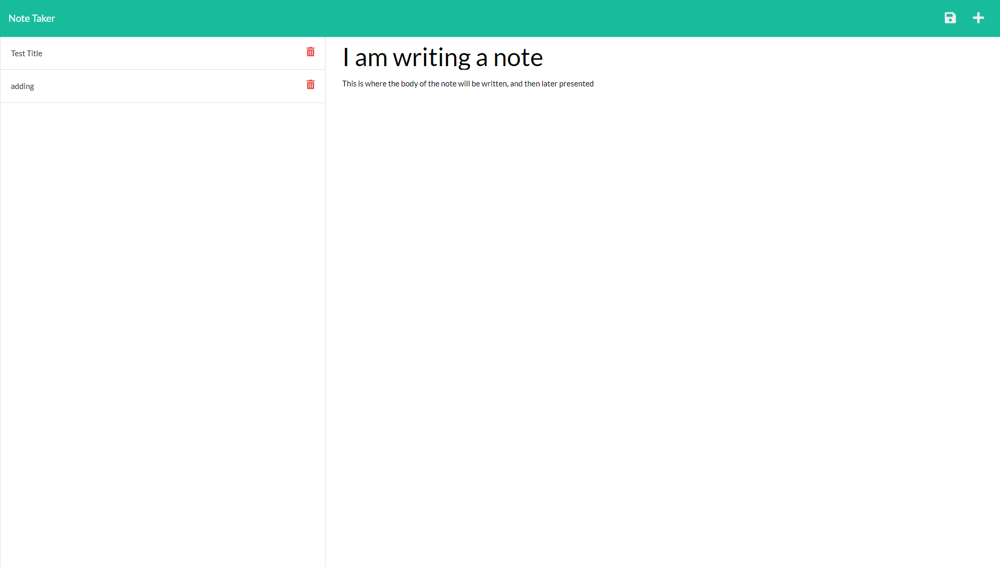
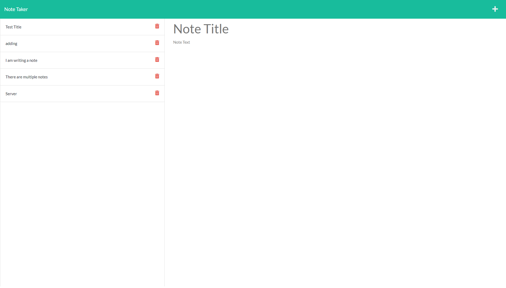

# Note Taker

## Description 
The user is allowed to take, save and delete notes in this application. When the user has included both title and body in the note, a save icon appears that will then append the note to the saved note list on the left side of the screen. If the user clicks on the text of a saved note, then that note shall appear, and if the user clicks on the trash can icon found to the right of the note in the note list, then that note shall disappear. All the information stays even after reloading the screen

[Deployed Page](https://note-taker-express-simsnap.herokuapp.com/)
## Table of Contents
* [Description](#description)
* [Instillation](#instillation)
* [Usage](#usage)
* [Contribution](#contribution)
* [Tests](#tests)
* [Questions](#questions)
## Instillation 
Clone this repository, and have node installed on your computer. This code has an express dependency which needs to be installed after the npm is set up in the folder
## Usage 
The user would set up the npm and instillation for this repository, and then launch it using "npm start" and open up the link, or they would go to the deployed link above, to then type out notes. The save icon would be used to save the note, and the trash can would be used to delete that note.

    
## Contribution
There are no contribution guidelines for this project
## Tests
There are no tests for this application

## Liscense
MIT License Copyright (c) 2022 Simona Snapkauskaite
Permission is hereby granted, free of charge, to any person obtaining a copy of this software and associated documentation files (the 'Software'), to deal in the Software without restriction, including without limitation the rights to use, copy, modify, merge, publish, distribute, sublicense, and/or sell copies of the Software, and to permit persons to whom the Software is furnished to do so, subject to the following conditions: The above copyright notice and this permission notice shall be included in all copies or substantial portions of the Software. THE SOFTWARE IS PROVIDED 'AS IS', WITHOUT WARRANTY OF ANY KIND, EXPRESS OR IMPLIED, INCLUDING BUT NOT LIMITED TO THE WARRANTIES OF MERCHANTABILITY, FITNESS FOR A PARTICULAR PURPOSE AND NONINFRINGEMENT. IN NO EVENT SHALL THE AUTHORS OR COPYRIGHT HOLDERS BE LIABLE FOR ANY CLAIM, DAMAGES OR OTHER LIABILITY, WHETHER IN AN ACTION OF CONTRACT, TORT OR OTHERWISE, ARISING FROM, OUT OF OR IN CONNECTION WITH THE SOFTWARE OR THE USE OR OTHER DEALINGS IN THE SOFTWARE.

https://mit-license.org/

## Questions
If you have any further questions contact me here:
 - Email simona.snapk@gmail.com
 - GitHub [SimonaSnap](https://github.com/SimonaSnap)
